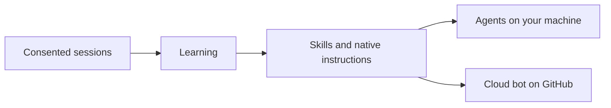

<div align="center">


[](https://www.npmjs.com/package/@shadowclone/cli)
[](https://github.com/theonly1me/shadowclone/actions/workflows/ci.yml)
[](https://github.com/theonly1me/shadowclone/releases)
[](https://www.npmjs.com/package/@shadowclone/cli)
[](LICENSE)
[](https://hol.org/registry/plugins/theonly1me%2Fshadowclone)

[Quick start](#quick-start) · [What you get](#what-you-get) · [Skills](#skills-in-the-box) · [Cloud bot](docs/guides/cloud-bot.md) · [Docs](#docs)

</div>

**Shadowclone makes coding agents follow your engineering taste, or any rules you configure, whatever the harness, agent, or model.** It works on your machine in Claude Code, Codex, Cursor, Pi, and Antigravity. It also works on GitHub as a cloud bot that uses your Claude Code or Codex token. The bot takes issues and mentions and reviews pull requests, like an agent with your engineering taste.

## Quick start

Setup takes about 2 to 3 minutes. Learning from past sessions takes up to 5 minutes for each run.

**Claude Code.** Add the plugin, then tell the agent: "Set up Shadowclone."

```text
/plugin marketplace add theonly1me/shadowclone
/plugin install shadowclone@shadowclone
```

**Codex.** Add the plugin, then tell the agent: "Set up Shadowclone."

```bash
codex plugin marketplace add theonly1me/shadowclone
codex plugin add shadowclone@shadowclone
```

**Any agent.** Install the CLI and open the build wizard in your browser. To learn from past sessions, run `shadowclone init` and then `shadowclone learn --deep`.

```bash
npm install -g @shadowclone/cli
shadowclone wizard
```

The wizard alone reads no sessions. Opening it sends no model request. Cursor, Antigravity, and Pi can use the portable [`setup-shadowclone` skill](plugins/shadowclone/skills/setup-shadowclone/SKILL.md).

## What you get

**Learning from your corrections.** Shadowclone finds the rules that you repeat in the sessions that you allow it to read. It turns them into skills and short native instructions. Learning runs on your machine. [Learning guide](docs/guides/learning.md).

**One setup for every agent and any model.** The same skills reach Claude Code, Codex, Cursor, Pi, and Antigravity. Pi can use any model that you configure in Pi, including local models. [Skill maintenance](docs/guides/skills.md) and [Pi setup](docs/guides/pi.md).

**Agent builds.** An Agent build is a set of workflow skills that you pick on a browser skill map. Choose a personal build, a private build for one repository, or a shared build that your team commits. [Agent builds guide](docs/guides/agent-builds.md).


**Cloud bot.** The bot is a GitHub account that you name. It runs in GitHub Actions with your Claude Code or Codex token. It works on issues, answers mentions, and reviews pull requests. You merge each pull request. [Cloud bot guide](docs/guides/cloud-bot.md).

**Pull request review and delegated work.** `shadowclone review 123` reviews a pull request on your machine. The `shadowclone-work` skill takes a request or a pull request to ready for review. [Reviews](docs/guides/reviews.md) and [delegated work](docs/guides/delegated-work.md).

## Skills in the box

Shadowclone bundles 14 workflow skills. You pick them in the wizard. Native routing lists the moment for each skill, and the agent loads the skill at that moment. `write-plain-english` is always on.

| Skill                         | Loads                                                          |
| ----------------------------- | -------------------------------------------------------------- |
| `choose-by-consequence`       | When a change adds a skip, block, fallback, default, or retry  |
| `design-deep-modules`         | When designing or reshaping a module or subsystem              |
| `diagnose-before-editing`     | When behavior is wrong or slow and the cause is not known      |
| `plan-with-review-page`       | Before a change that has many steps or open design choices     |
| `research-primary-sources`    | When a decision depends on facts outside the repository        |
| `resolve-conflicts-by-intent` | While a merge, rebase, or cherry-pick has conflicts            |
| `scope-confirmed-changes`     | When fixing a bug, a regression, or a confirmed review finding |
| `shadowclone-review`          | When a pull request needs a review                             |
| `shadowclone-work`            | When taking a change or a pull request to ready for review     |
| `tests-that-catch-bugs`       | When adding, changing, or proving a test                       |
| `typescript-type-safety`      | When changing TypeScript types or input that enters typed code |
| `verify-and-review`           | Before you say that work is done or ready for review           |
| `verify-review-findings`      | When a pull request has review comments or bot findings        |
| `write-plain-english`         | Before you write any text that a person reads (always on)      |

## Results

A test of 24 fixed tasks ran three times for each setup and model. Shadowclone learning scored above existing user skills on all four models. The scores measure preference adherence on synthetic tasks. [Setups, methods, and limits](evals.md).

| Setup                                  | GPT 6.1 Sol | GPT 6 Luna | Claude Sonnet 5.5 | Claude Opus 5.5 |
| -------------------------------------- | ----------: | ---------: | ----------------: | --------------: |
| Agent alone                            |       77.3% |      59.0% |             56.5% |           53.2% |
| Existing user skills                   |       85.2% |      80.6% |             76.4% |           73.6% |
| Existing skills + Shadowclone learning |       89.4% |      83.3% |             90.0% |           82.9% |

## How it works



Shadowclone indexes references to the sessions that you enable and does not copy transcripts. It redacts the text and learns rules.

One session can give an explicit rule, and an inferred pattern needs three independent sessions. Shadowclone publishes rules as skills that you can read, edit, and undo. It changes the guidance that a model receives, not the model. See the [architecture](docs/architecture/README.md).

## Privacy

- **No collection service.** Shadowclone has no telemetry. Model work uses the agent CLI that you choose.
- **Consent for each source.** Every source is off by default and has its own setting.
- **Redaction.** Tool results, tool-returned file contents, and thinking blocks never enter learning.
- **Removal.** Run `shadowclone learning disable`, `shadowclone skills automatic off`, or `shadowclone forget --all`.

Read the [privacy policy](PRIVACY.md) and [data handling](docs/data-handling.md).

## Docs

| Guide                                            | Use it to                                                        |
| ------------------------------------------------ | ---------------------------------------------------------------- |
| [Agent builds](docs/guides/agent-builds.md)      | Pick skills on the skill map and choose a build scope            |
| [Learning](docs/guides/learning.md)              | Run deep learning, turn on background learning, or record a rule |
| [Skill maintenance](docs/guides/skills.md)       | Review updates and conflicts, and undo a change                  |
| [Repository setup](docs/guides/repositories.md)  | Share checks and skills with a repository                        |
| [Pi setup](docs/guides/pi.md)                    | Use Pi models, including local models                            |
| [Delegated work](docs/guides/delegated-work.md)  | Take a change or a pull request to ready for review              |
| [Cloud bot](docs/guides/cloud-bot.md)            | Set up a GitHub bot for issues, mentions, and reviews            |
| [Reviews](docs/guides/reviews.md)                | Review a pull request on your machine or in the cloud            |
| [MCP server](docs/guides/mcp.md)                 | Give a connected agent the Shadowclone tools                     |
| [Command reference](docs/guides/commands.md)     | Find every command                                               |
| [Migration](docs/guides/migration.md)            | Move a profile installation to skills                            |
| [Enterprise controls](docs/guides/enterprise.md) | Set scope and managed policy                                     |

More: [documentation index](docs/README.md), [motivation](docs/motivation.md), [design history](docs/design/README.md), and [security](SECURITY.md).

## Contributing

Read [CONTRIBUTING.md](CONTRIBUTING.md) before you open a pull request. Shadowclone uses the MIT license. If Shadowclone saves you a correction, star the repository.
