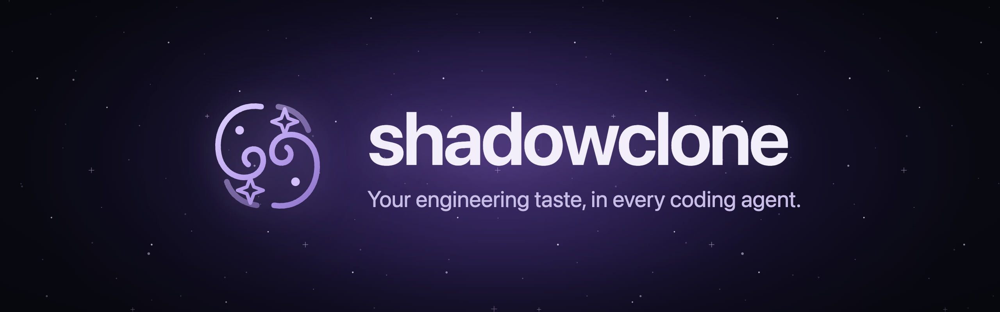
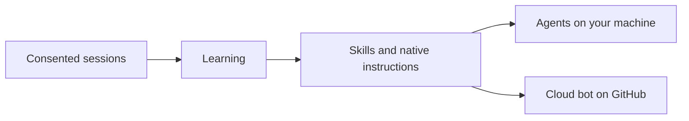

<div align="center">



[](https://www.npmjs.com/package/@shadowclone/cli)
[](https://github.com/theonly1me/shadowclone/actions/workflows/ci.yml)
[](LICENSE)
[](https://hol.org/registry/plugins/theonly1me%2Fshadowclone)

[Quick start](#quick-start) · [What you get](#what-you-get) · [Skills](#skills-in-the-box) · [Cloud bot](docs/guides/cloud-bot.md) · [Docs](#docs)

</div>

**Shadowclone makes coding agents follow your engineering taste, or any rules you configure, whatever the harness, agent, or model.** It works in Claude Code, Codex, Cursor, Pi, and Antigravity on your machine. It also runs on GitHub as a cloud bot with your Claude Code or Codex token. The bot works on issues, answers mentions, and reviews pull requests, like an agent with your engineering taste.

## Quick start

Setup takes about 2 to 3 minutes. Each learning run takes up to 5 minutes.

**Claude Code.** Add the plugin and tell the agent: "Set up Shadowclone."

```text
/plugin marketplace add theonly1me/shadowclone
/plugin install shadowclone@shadowclone
```

**Codex.** Add the plugin and give the same instruction.

```bash
codex plugin marketplace add theonly1me/shadowclone
codex plugin add shadowclone@shadowclone
```

**Any agent.** Install the CLI and open the build wizard. To learn from past sessions, run `shadowclone init` and then `shadowclone learn --deep`. The wizard alone reads no sessions and sends no model request.

```bash
npm install -g @shadowclone/cli
shadowclone wizard
```

Cursor, Antigravity, and Pi use the portable [`setup-shadowclone` skill](plugins/shadowclone/skills/setup-shadowclone/SKILL.md).

## What you get

- **Learning from your corrections.** Rules that you repeat in allowed sessions become skills and short native instructions.
- **One setup for every agent and model.** The same skills reach all five agents. Pi can use any model that you configure.
- **Agent builds.** Pick workflow skills on a browser skill map. Equip a personal build, a private build for one repository, or a shared build that your team commits. [Agent builds guide](docs/guides/agent-builds.md).
- **Cloud bot.** A GitHub account that you name runs in GitHub Actions with your Claude Code or Codex token. It works on issues, answers mentions, and reviews pull requests. You merge each pull request. [Cloud bot guide](docs/guides/cloud-bot.md).
- **Reviews and delegated work.** `shadowclone review 123` reviews a pull request on your machine. The `shadowclone-work` skill takes a change to ready for review.


## Skills in the box

Shadowclone bundles 14 workflow skills. Pick them in the wizard.

| Skill                         | Loads when                              |
| ----------------------------- | --------------------------------------- |
| `choose-by-consequence`       | A change adds a skip or fallback        |
| `design-deep-modules`         | You design a module                     |
| `diagnose-before-editing`     | The cause of a failure is unknown       |
| `plan-with-review-page`       | A change has many steps                 |
| `research-primary-sources`    | A decision needs outside facts          |
| `resolve-conflicts-by-intent` | A merge or rebase has conflicts         |
| `scope-confirmed-changes`     | You fix a bug or review finding         |
| `shadowclone-review`          | A pull request needs a review           |
| `shadowclone-work`            | You take a change to ready for review   |
| `tests-that-catch-bugs`       | You add or change a test                |
| `typescript-type-safety`      | You change TypeScript types             |
| `verify-and-review`           | Before you say that work is done        |
| `verify-review-findings`      | A pull request has review comments      |
| `write-plain-english`         | You write text for a person (always on) |

## Results

Across 24 fixed tasks, Shadowclone learning scored above existing user skills on all four models. Scores measure preference adherence on synthetic tasks. See [setups, methods, and limits](evals.md).

| Setup                                  | GPT 6.1 Sol | GPT 6 Luna | Claude Sonnet 5.5 | Claude Opus 5.5 |
| -------------------------------------- | ----------: | ---------: | ----------------: | --------------: |
| Agent alone                            |       77.3% |      59.0% |             56.5% |           53.2% |
| Existing user skills                   |       85.2% |      80.6% |             76.4% |           73.6% |
| Existing skills + Shadowclone learning |       89.4% |      83.3% |             90.0% |           82.9% |

## How it works



Shadowclone indexes references to enabled sessions and copies no transcript. It redacts text and learns rules. One session can give an explicit rule, and an inferred pattern needs three independent sessions. Rules become skills that you can read, edit, and undo. Shadowclone changes the guidance, not the model. See the [architecture](docs/architecture/README.md).

## Privacy

- **No collection service.** No telemetry. Model work uses the agent CLI that you choose.
- **Consent.** Every source is off by default and has its own setting.
- **Redaction.** Tool results, tool-returned file contents, and thinking blocks never enter learning.
- **Removal.** Run `shadowclone learning disable`, `shadowclone skills automatic off`, or `shadowclone forget --all`.

Read the [privacy policy](PRIVACY.md) and [data handling](docs/data-handling.md).

## Docs

| Guide                                            | Use it to             |
| ------------------------------------------------ | --------------------- |
| [Agent builds](docs/guides/agent-builds.md)      | Pick skills and scope |
| [Learning](docs/guides/learning.md)              | Learn from sessions   |
| [Skill maintenance](docs/guides/skills.md)       | Review updates, undo  |
| [Repository setup](docs/guides/repositories.md)  | Share checks          |
| [Pi setup](docs/guides/pi.md)                    | Use Pi models         |
| [Delegated work](docs/guides/delegated-work.md)  | Ready a pull request  |
| [Cloud bot](docs/guides/cloud-bot.md)            | Set up the GitHub bot |
| [Reviews](docs/guides/reviews.md)                | Review a pull request |
| [MCP server](docs/guides/mcp.md)                 | Give agents the tools |
| [Command reference](docs/guides/commands.md)     | Find every command    |
| [Migration](docs/guides/migration.md)            | Move to skills        |
| [Enterprise controls](docs/guides/enterprise.md) | Set scope and policy  |

More: [documentation index](docs/README.md), [motivation](docs/motivation.md), [design history](docs/design/README.md), [security](SECURITY.md).

## Contributing

Read [CONTRIBUTING.md](CONTRIBUTING.md) before you open a pull request. Shadowclone uses the MIT license. If Shadowclone saves you a correction, star the repository.
