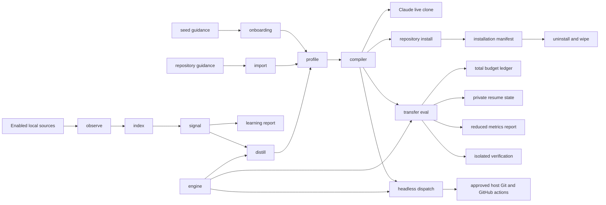

# Architecture

Shadowclone aims to help agents follow the way you work. It compiles editable behavioral guidance from enabled sources for live subagents and bounded headless tasks. Human-equivalent reasoning is a goal, not an established capability.

It learns from the transcripts your agents already write to disk. It acts by driving the agent CLIs you already pay for. It has no hosted collection service; provider processes may receive their own configured authentication.

## Documents

| File | Covers |
| --- | --- |
| `01-capture.md` | What gets read, how it is normalized, how it stays incremental |
| `02-profile.md` | How raw sessions become a behavioral profile you can read and edit |
| `03-engine.md` | Driving the user's own agent subscriptions instead of an API key |
| `04-acting.md` | How a clone runs a task, and the ceiling on what it may do |
| `05-privacy.md` | The egress gate, retention, consent, and the one-step wipe |
| `06-roadmap.md` | Build order and what is deliberately not built yet |
| `07-enterprise.md` | Organization boundaries, and what to hand a security reviewer |
| `08-landscape.md` | What already exists, the gap, and what to borrow from prior work |
| `09-evaluation.md` | Experimental transfer evaluation, cumulative budgets, and private resume state |

Per-change design docs live in `docs/design/`, one file per change, written against `docs/design/template.md` and listed chronologically in `docs/design/README.md`.

## The loop

| Stage | Module | What it does |
| --- | --- | --- |
| guidance | `src/skills/` | Loads package-owned preferences and Agent Skills for a declared starting profile |
| onboarding | `src/cli/init.ts`, `src/cli/wizard.ts` | Selects declared rules before collecting source consent |
| import | `src/importRules/` | Discovers bounded repository guidance and resolves it through redaction |
| observe | `src/observe/` | Normalizes agent transcripts into one event stream |
| index | `src/index/` | A rebuildable SQLite cache of pointers and skeletons |
| signal | `src/signal/` | Derives behavior in pure code, no model, no network |
| report | `src/profile/mirror.ts` | Renders aggregate evidence and a deep-learning preview without writing rules |
| distill | `src/distill/` | Turns high signal moments into written rules |
| profile | `src/profile/` | Plain markdown you can read, edit, and diff |
| compiler | `src/profile/compiler/` | The one bounded, deterministic projection every clone reads |
| install | `src/cli/install.ts` | Writes repository artifacts and records them for removal |
| dispatch | `src/dispatch/` | Runs a task in a worktree and leaves a receipt |
| eval | `src/eval/` | Compares historical task outcomes with and without learned guidance |
| engine | `src/engine/` | The one way a model gets called, by any stage |

`src/cli/` coordinates the stages. `src/engine/` is the shared process boundary for distillation, dispatch, and evaluation. Selected captured text and profile snapshots pass through the shared bounded materialization and redaction service before learning or import. Verification output remains outside judge evidence.

## Why agent transcripts

The first version of this project read `~/.zsh_history`. That was the wrong input.

Shell history records what a person typed. It shows `git status`, `bun test`, and a lot of `cd`. It does not show why they chose an approach, what they rejected, how they verify work, or what they refuse to let an agent do.

Most people are not heavy terminal users, so for most people the file is close to empty.

Agent transcripts record the opposite: a turn by turn recording of a person steering an agent, which is the job the clone has to do.

Session histories can contain repeated steering decisions. Whether those observations produce useful transferable guidance remains an evaluation question.

## Why the user's own subscription

Shadowclone calls no model API of its own. It shells out to `claude`, `codex`, or `cursor-agent`, which are already installed and already authenticated.

This is a product decision before it is a technical one. Asking a new user to paste an API key is the single largest drop off in a local AI tool, and it puts the maintainer on the hook for other people's inference bills. Driving the installed CLI removes both. If you can run `claude`, you can run shadowclone.

It also gives the privacy statement: model work uses the selected provider account, and Shadowclone chooses additional derived inputs to send through it. `03-engine.md` covers the abstraction and the fallbacks, including a planned local path through Ollama for people who want zero egress.

## What is settled and what is not

Five questions were open in the previous version of this document. Four are now closed.

**Should the distiller be provider agnostic.** Yes, and `src/engine/` is the abstraction. See `03-engine.md`.

**What is the vault's schema, and is it files or a database.** Both, split by purpose. Plain markdown holds what was learned about the user, because a user who cannot read what was learned about them cannot consent to it. SQLite holds source locators and skeletons, and is declared a disposable cache that can be deleted and rebuilt. See `02-profile.md`.

**What triggers the clone.** A CLI command or a Claude Code `SessionEnd` hook. A daemon is not implemented. Incremental cursors make all three cheap. See `01-capture.md`.

**How does the act stage get its capabilities.** It does not get capabilities of its own. It borrows the agent CLI's tools and narrows them with a per repo policy. See `04-acting.md`.

**What is the retention window.** No automatic expiry is implemented. Private derived artifacts persist until removed. See `05-privacy.md`.
