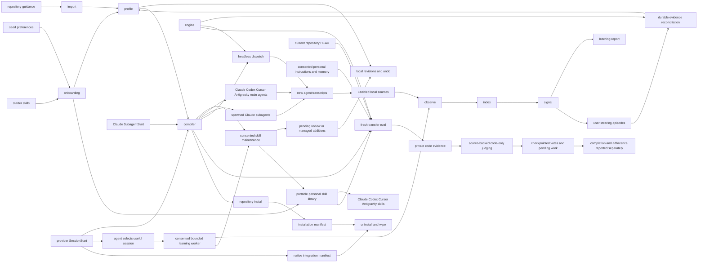

# Architecture

Shadowclone maintains an editable engineering-preference profile and a portable personal skill library for existing coding agents. Consented local transcripts supply reusable user guidance. Ordinary sessions and supported delegated runs receive the same scoped profile; selected useful sessions can feed later learning.

It reads named, opt-in sources. Eligible captured excerpts pass through `resolveRedacted` before they reach the user's authenticated agent CLI. Evaluation separately exposes an authorized repository snapshot and unredacted generated code to that provider. Shadowclone has no service, API key, or telemetry. The profile is editable Markdown, and `shadowclone forget --all` removes stored state and recorded integrations while preserving unrelated content and refusing conflicting edits.

The profile is additional model context, not a trained model or a guarantee of adherence. The [early evaluation report](../../evals.md) compares repository-only, personal-context, and profile-equipped setups and records the limitations of that evidence.

## Documents

| File | Covers |
| --- | --- |
| `01-capture.md` | What gets read, how it is normalized, how it stays incremental |
| `02-profile.md` | How raw sessions become a behavioral profile you can read and edit |
| `03-engine.md` | Driving the user's own agent subscriptions instead of an API key |
| `04-acting.md` | How a clone runs a task, and the ceiling on what it may do |
| `05-privacy.md` | The egress gate, retention, consent, and the one-step wipe |
| `06-roadmap.md` | Build order and what is deliberately not built yet |
| `07-enterprise.md` | Organization boundaries, and what to hand a security reviewer |
| `08-landscape.md` | What already exists, the gap, and what to borrow from prior work |
| `09-evaluation.md` | Three-arm current-HEAD comparison, source-backed judging, recovery, and reporting |

Per-change design records live in `docs/design/`. They explain decisions at the time of each change; later records can supersede them. This architecture directory describes current behavior.

## The loop

| Stage | Module | What it does |
| --- | --- | --- |
| guidance | `src/skills/` | Loads package-owned preferences and installs complete starter skills into the portable personal library |
| onboarding | `src/cli/init.ts`, `src/cli/initAdvanced.ts`, `src/cli/wizard.ts` | Shows detected sources, asks three grouped questions by default, and keeps individual choices in advanced mode |
| import | `src/importRules/` | Discovers bounded repository guidance and resolves it through redaction |
| observe | `src/observe/` | Normalizes agent transcripts into one event stream |
| index | `src/index/` | A rebuildable SQLite cache of pointers and skeletons |
| signal | `src/signal/` | Derives behavior in pure code, no model, no network |
| report | `src/profile/mirror.ts` | Renders aggregate evidence and a deep-learning preview without writing rules |
| distill | `src/distill/` | Turns high signal moments into written rules |
| session learning | `src/learning/` | Stores opaque useful-session requests, serializes bounded catch-up, and tracks processed episode hashes |
| revisions | `src/changes/` | Records before/after local files and refuses conflicting undo |
| skill maintenance | `src/skillMaintenance/` | Synchronizes portable copies, assesses consented roots, preserves original workflows, and records review decisions |
| profile | `src/profile/` | Plain markdown you can read, edit, and diff |
| compiler | `src/profile/compiler/` | The one bounded, deterministic projection every clone reads |
| install | `src/cli/install.ts` | Writes repository artifacts and records them for removal |
| native delivery | `src/integrations/` | Preserves a stable native pointer, injects live scoped context, merges hooks, and tracks ownership |
| dispatch | `src/dispatch/` | Runs a task in a worktree and leaves a receipt |
| eval | `src/eval/transfer/` | Compares Bare, Skills, and Clone on fresh tasks with saved criterion votes and separate correctness grading |
| engine | `src/engine/` | The one way a model gets called, by any stage |

`src/cli/` coordinates the stages. `src/engine/` is the shared process boundary for distillation, dispatch, and evaluation. Captured text comes into existence only through `resolveRedacted` before it reaches `distill` or repository guidance import, which keeps every materialization path auditable.

## Why agent transcripts

The first version of this project read `~/.zsh_history`. Agent transcripts became the primary input because they include user steering and corrections.

Shell history records what a person typed. It shows `git status`, `bun test`, and a lot of `cd`. It does not show why they chose an approach, what they rejected, how they verify work, or what they refuse to let an agent do.

Agent transcripts can include the explanation behind a correction or an approved approach. Shadowclone assesses that steering for durable guidance; it does not treat every interaction as a preference.

## Why the user's own subscription

Shadowclone calls no model API of its own. It shells out to `claude`, `codex`, or `cursor-agent`, which are already installed and already authenticated.

Using an installed authenticated CLI avoids a separate Shadowclone account or API-key setup. Calls still consume provider quota and expose the approved input to that provider. Existing authentication does not itself grant permission to analyze another repository or transcript. `03-engine.md` covers the implemented runners and the API or local-endpoint paths that remain unimplemented.

## What is settled and what is not

Five questions were open in the previous version of this document. Four are now closed.

**Should the distiller be provider agnostic.** Yes, and `src/engine/` is the abstraction. See `03-engine.md`.

**What is the vault's schema, and is it files or a database.** Both, split by purpose. Plain markdown holds what was learned about the user, because a user who cannot read what was learned about them cannot consent to it. SQLite holds source locators and skeletons, and is declared a disposable cache that can be deleted and rebuilt. See `02-profile.md`.

**What updates the environment.** Default setup runs a bounded first pass over recent consented steering. Explicit CLI learning runs on demand. With separate deep and automatic consent, the main agent can mark a substantive session containing reusable guidance or a clear correction, and the native end hook schedules bounded learning for that session. A stop or session end alone does not schedule learning. See `01-capture.md`.

**How does the act stage get its capabilities.** It does not get capabilities of its own. It borrows the agent CLI's tools and narrows them with a per repo policy. See `04-acting.md`.

**What is the retention window.** Still open. Shadowclone stores pointers to original transcripts, so the question concerns the disposable index and derived state. See `05-privacy.md`.
