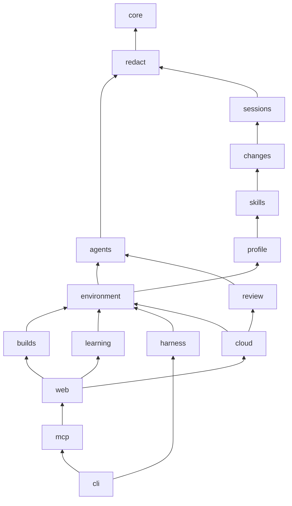
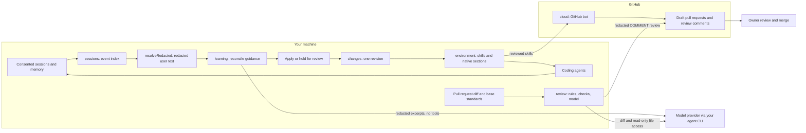

# Architecture

Shadowclone turns durable guidance from consented sessions into skills that coding agents use. Local records keep evidence, scope, publication decisions, and revisions. Native instructions route tasks to skills.

## Packages

The repository is a Bun workspace. Each package is `@shadowclone/<name>` and has an `AGENTS.md` with its rules.

| Package                                               | Purpose                                              |
| ----------------------------------------------------- | ---------------------------------------------------- |
| [`core`](../../packages/core/AGENTS.md)               | Files, processes, ownership, configuration, identity |
| [`redact`](../../packages/redact/AGENTS.md)           | Secret scrubbing                                     |
| [`agents`](../../packages/agents/AGENTS.md)           | Run agent CLIs without a terminal                    |
| [`sessions`](../../packages/sessions/AGENTS.md)       | Transcripts, event index, redacted text              |
| [`review`](../../packages/review/AGENTS.md)           | Pull request review engine                           |
| [`changes`](../../packages/changes/AGENTS.md)         | Reversible local writes, stored as revisions         |
| [`skills`](../../packages/skills/AGENTS.md)           | Skill files without model calls                      |
| [`profile`](../../packages/profile/AGENTS.md)         | Learned rules, legacy profile, memory migration      |
| [`environment`](../../packages/environment/AGENTS.md) | Publication, native sections, install, and undo      |
| [`builds`](../../packages/builds/AGENTS.md)           | Agent builds                                         |
| [`learning`](../../packages/learning/AGENTS.md)       | Distillation, reconciliation, probes, `remember`     |
| [`harness`](../../packages/harness/AGENTS.md)         | Repository harness for `init --repo` and `check`     |
| [`cloud`](../../packages/cloud/AGENTS.md)             | GitHub bot setup and workflows                       |
| [`web`](../../packages/web/AGENTS.md)                 | Wizard, voice capture, browser bot setup             |
| [`mcp`](../../packages/mcp/AGENTS.md)                 | MCP server                                           |
| [`cli`](../../packages/cli/AGENTS.md)                 | Commands, build, and publish                         |
| [`evals`](../../evals/AGENTS.md)                      | Private evaluation suites                            |
| [`tooling`](../../tooling/AGENTS.md)                  | Repository checks that `bun run lint` runs           |

`skills/`, `preferences/`, and `plugins/` stay at the repository root, where installers look. Only `@shadowclone/cli` goes to npm, and its build bundles the other packages.

## Dependencies

An arrow points from a package to a package that it imports. The graph omits an arrow that another path implies. For example, `cli` also declares `review`, but `mcp`, `web`, and `cloud` already lead to it.

```mermaid
graph BT
  redact --> core
  agents --> redact
  sessions --> redact
  changes --> sessions
  skills --> changes
  profile --> skills
  environment --> profile
  environment --> agents
  builds --> environment
  learning --> environment
  harness --> environment
  review --> agents
  cloud --> environment
  cloud --> review
  web --> builds
  web --> cloud
  web --> learning
  mcp --> web
  cli --> mcp
  cli --> harness
```

`tooling/src/boundaries/packages.ts` lists the allowed imports. `bun run lint` checks every import against it and fails on a cycle. A package exposes `.` and, where needed, `./testing` for fixtures and `./browser` for web client modules. See [design record 038](../design/038-packages-and-plain-english.md).

## Data flow

Data stays on your machine except for the requests and GitHub actions that you authorize. [Data handling](../data-handling.md) lists every source, file, and request.

```mermaid
flowchart LR
  subgraph Machine["Your machine"]
    Sources["Consented sessions and memory"] --> Index["sessions: event index"]
    Index --> Redaction["resolveRedacted: redacted user text"]
    Redaction --> Learning["learning: reconcile guidance"]
    Learning --> Review["Apply or hold for review"]
    Review --> Revision["changes: one revision"]
    Revision --> Delivery["environment: skills and native sections"]
    Delivery --> Agents["Coding agents"]
    Agents --> Sources
    Diff["Pull request diff and base standards"] --> Judge["review: rules, checks, model"]
  end
  Learning -- "redacted excerpts, no tools" --> Provider["Model provider via your agent CLI"]
  Judge -- "diff and read-only file access" --> Provider
  Delivery -- "reviewed skills" --> Bot["cloud: GitHub bot"]
  subgraph GitHub["GitHub"]
    Bot --> Pulls["Draft pull requests and review comments"]
  end
  Judge -- "redacted COMMENT review" --> Pulls
  Pulls --> Owner["Owner review and merge"]
```

## Trust boundaries

| Boundary                | What crosses it                           | Control                                                               |
| ----------------------- | ----------------------------------------- | --------------------------------------------------------------------- |
| Source files to index   | Pointers and event metadata, no text      | A default-off consent flag for each source. Policy can only narrow it |
| Index to model          | Redacted user text, labeled agent context | `resolveRedacted`, then a run with no tools and fixed limits          |
| Model output to files   | Proposed skill and native edits           | Reversible revisions, ownership fingerprints, kept manual edits       |
| Browser to local server | Wizard actions                            | Loopback, ephemeral token, origin check                               |
| Machine to GitHub       | Reviewed skills, secrets, review text     | Owner approval of an exact preview. Secrets use standard input        |
| Evaluation              | Synthetic tasks, receipts, held-out cases | Private storage outside checkouts. Approved scope per paid run        |

## How the packages work together

`sessions` indexes events and gives `learning` only the text that current consent allows. `learning` reconciles that text with existing guidance and calls the model through `agents`. It holds a proposal for review when evidence is weak, in conflict, or out of scope.

`environment` publishes accepted guidance as skills and short native sections through `changes`, so each publication is one revision that `undo` can reverse. `builds` and `harness` use the same path.

The code checks source authorization when it selects an event and again when it resolves the reference. A later correction creates a review signal. A probe sends redacted guidance to an isolated native session, and its exact-response check does not prove hook delivery or future compliance.

## Delegated work

Outside the cloud bot, Shadowclone does not commit, push, or act on GitHub itself. Delegated work is the `shadowclone-work` skill. It acts through the tools and permissions of your agent session. See [delegated work](../guides/delegated-work.md).

The cloud bot is a separate contract. The owner reviews a frozen skills bundle and chooses the repositories. GitHub Actions run the same skill, and the owner merges. See the [cloud bot guide](../guides/cloud-bot.md).

Design records [029](../design/029-narrow-the-surface.md) and [030](../design/030-shadowclone-work-eval.md) explain the removed `run` command and task harness. A review comment, a merge, a deletion, or a successful agent result does not establish a preference.

More detail: [capture](01-capture.md), [learning and skill delivery](02-profile.md), and [engine](03-engine.md).
