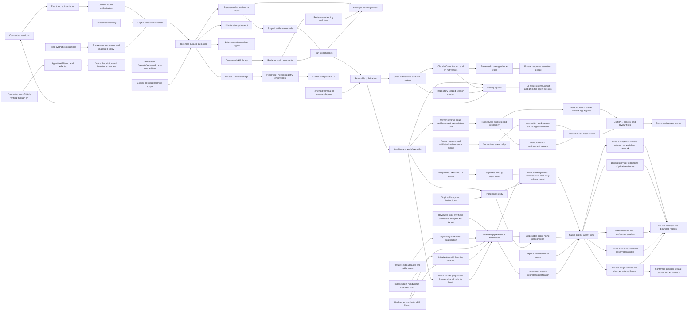

# Architecture

Shadowclone turns durable guidance from consented sessions into skills used by existing coding agents. Evidence, scope, publication decisions, and revisions stay in local records. Native instructions route tasks to the relevant skills.

## Data flow

```mermaid
flowchart LR
    Sessions[Consented sessions] --> Index[Event and pointer index]
    Index --> Consent[Current source authorization]
    Consent --> Redaction[Eligible redacted excerpts]
    Memory[Consented memory] --> Redaction
    Redaction --> Learning[Reconcile durable guidance]
    Learning --> Decision[Apply, pending review, or reject]
    Decision --> Records[Scoped evidence records]
    Decision --> Pending[Changes needing review]
    Learning --> Receipt[Private attempt receipt]
    Learning --> Feedback[Later correction review signal]
    Records --> Planner[Plan skill changes]
    Library[Consented skill library] --> SkillText[Redacted skill documents]
    SkillText --> Planner
    SkillText --> Review[Review overlapping workflows]
    Review --> Pending
    Planner --> Pending
    Planner --> Publish[Reversible publication]
    Build[Reviewed terminal or browser choices] --> Publish
    GitHubWriting[Consented own GitHub writing through gh] --> VoiceFilter[Agent text filtered and redacted]
    VoiceFilter --> VoiceModel[Voice description and invented examples]
    VoiceModel --> VoiceFile[Reviewed ~/.agents/voice.md, never overwritten]
    Publish --> Skills[Baseline and workflow skills]
    Publish --> Routing[Short native rules and skill routing]
    Routing --> Claude[Claude Code, Codex, and Pi native files]
    Routing --> ScopedHook[Repository scoped session context]
    Skills --> Agents[Coding agents]
    Claude --> Agents
    Claude --> Probe[Reviewed frozen guidance probe]
    Probe --> ProbeReceipt[Private response assertion receipt]
    ScopedHook --> Agents
    Agents --> GitHub[Pull requests through git and gh in the agent session]
    CloudApproval[Owner reviews cloud guidance and subscription use] --> CloudSetup[Named App and selected repository]
    Skills --> CloudApproval
    CloudSetup --> Environment[Default-branch environment secrets]
    CloudSetup --> Ruleset[Default-branch ruleset without App bypass]
    Ruleset --> DraftPR
    GitHubEvents[Owner requests and validated maintenance events] --> Relay[Secret-free event relay]
    Relay --> Guard[Live entity, head, pause, and budget validation]
    Guard --> CloudWorker[Pinned Claude Code Action]
    Environment --> CloudWorker
    CloudWorker --> DraftPR[Draft PR, checks, and review fixes]
    DraftPR --> OwnerMerge[Owner review and merge]
    Agents --> Sessions
    Learning --> PiBridge[Private Pi model bridge]
    PiBridge --> PiRegistry[Pi provider-neutral registry, empty tools]
    PiRegistry --> Models[Model configured in Pi]
    Skills --> Eval[Preference study]
    Original[Original library and instructions] --> Eval
    FixedFixtures[Reviewed fixed synthetic cases and independent target] --> FixedEval[Five-setup preference evaluation]
    Heldout[Private held-out cases and public seals] --> Qualification[Separately authorized qualification]
    Qualification --> FixedEval
    Told[Independent handwritten intended skills] --> FixtureRouting
    RoutingLibrary[20 synthetic skills and 12 cases] --> RoutingEval[Separate routing experiment]
    RoutingEval --> Workspaces
    SyntheticSkills[Unchanged synthetic skill library] --> FixtureRouting[Initialization with learning disabled]
    SyntheticSkills --> FixedEval
    FixtureRouting --> FixedEval
    SyntheticCorrections[Fixed synthetic corrections] --> FixtureConsent[Private source consent and managed policy]
    FixtureConsent --> Redaction
    FixtureGrant[Explicit bounded learning scope] --> Learning
    Skills --> FixtureFreeze[Three private preparation freezes shared by both hosts]
    FixtureFreeze --> FixedEval
    FixedEval --> Workspaces
    FixedEval --> Homes
    Eval --> Workspaces[Disposable synthetic workspace or read-only advice mount]
    Eval --> Homes[Disposable agent home per condition]
    Workspaces --> Candidates[Native coding-agent runs]
    Homes --> Candidates
    EvalGrant[Explicit evaluation call scope] --> Candidates
    FixedEval --> NativeQualification[Model-free Codex filesystem qualification]
    NativeQualification --> Candidates
    Candidates --> Checks[Local acceptance checks without credentials or network]
    Candidates --> FixedGrades[Fixed deterministic preference graders]
    Candidates --> Judges[Blinded provider judgments of private evidence]
    Checks --> Receipts[Private receipts and bounded reports]
    Judges --> Receipts
    FixedGrades --> Receipts
    Candidates --> Diagnostics[Private stage failures and charged attempt ledger]
    Candidates --> Transport[Private native transport for observation audits]
    Transport --> Receipts
    Diagnostics --> QuotaPause[Confirmed provider refusal pauses further dispatch]
    Diagnostics --> Receipts
```

## Components

| Component                              | Responsibility                                                                                           |
| -------------------------------------- | -------------------------------------------------------------------------------------------------------- |
| `src/config/`                          | Source consent and managed policy                                                                        |
| `src/observe/`, `src/index/`           | Incremental transcript parsing and a rebuildable pointer index                                           |
| `src/redact/`, `src/signal/`           | Materialize eligible excerpts and identify learning evidence                                             |
| `src/distill/`, `src/learning/`        | Reconcile guidance within shared call, time, and supported cost limits                                   |
| `src/environment/`                     | Store evidence, publish skills, migrate installations, and preserve originals                            |
| `src/skillMaintenance/`, `src/skills/` | Discover consented libraries, preserve ownership, and provide starter workflows                          |
| `src/builds/`, `src/web/`              | Apply reviewed skill selections through terminal and browser interfaces                                  |
| `src/voice/`                           | Read consented own GitHub writing and save a reviewed voice description                                  |
| `src/integrations/`, `src/harness/`    | Install native guidance and repository instructions/checks                                               |
| `src/engine/`                          | Invoke authenticated agent CLIs                                                                          |
| `src/cloud/`                           | Export reviewed guidance, register personal Apps, and generate guarded GitHub workflows                  |
| `evals/`, `src/changes/`               | Run reviewed learning and routing suites, record workflow outcomes, and retain reversible file revisions |
| `src/profile/`                         | Legacy profile compatibility and the reconciliation boundary                                             |

The learning service coordinates model execution, reconciliation, pending decisions, and persistence for both CLI and background paths. Its maintenance service selects the active environment or legacy fallback; the skill-maintenance package supplies library primitives and retains a compatibility entry point. The CLI owns prompts and presentation. Source authorization is checked at selection and again when a reference is resolved. Automatic skill writes require separate authorization. Reviewed build edits use the same publication and revision machinery as learning. Later corrections create review signals. An explicitly authorized probe sends redacted installed guidance into an isolated native session; its exact-response assertion does not establish hook delivery or future compliance.

## Read by topic

- [Capture](01-capture.md): source adapters, eligible content, and incremental indexing.
- [Learning and skill delivery](02-profile.md): evidence, publication, scope, and migration.
- [Engine](03-engine.md): provider capabilities and execution limits.
- [Acting](04-acting.md): how delegated work acts through the host agent.
- [Privacy boundaries](05-privacy.md): redaction, ownership, and execution isolation.
- [Development priorities](06-roadmap.md): remaining qualification and research work.
- [Organization boundaries](07-enterprise.md): scope and managed policy.
- [Related approaches](08-landscape.md): how skills, memory, and transcript learning fit together.
- [Evaluation](09-evaluation.md): reviewed learning and routing suites, private execution, and family-weighted results.

The [data-handling guide](../data-handling.md) owns the source and storage inventory. [Design records](../design/README.md) explain historical decisions; their original implementation details may have been superseded.
