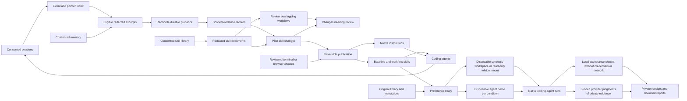

# Architecture

Shadowclone turns durable guidance from consented sessions into skills used by existing coding agents. Evidence, scope, publication decisions, and revisions stay in local records. Native instructions route tasks to the relevant skills.

## Data flow

```mermaid
flowchart LR
    Sessions[Consented sessions] --> Index[Event and pointer index]
    Index --> Redaction[Eligible redacted excerpts]
    Memory[Consented memory] --> Redaction
    Redaction --> Learning[Reconcile durable guidance]
    Learning --> Records[Scoped evidence records]
    Records --> Planner[Plan skill changes]
    Library[Consented skill library] --> SkillText[Redacted skill documents]
    SkillText --> Planner
    SkillText --> Review[Review overlapping workflows]
    Review --> Pending
    Planner --> Pending[Changes needing review]
    Planner --> Publish[Reversible publication]
    Build[Reviewed terminal or browser choices] --> Publish
    Publish --> Skills[Baseline and workflow skills]
    Publish --> Routing[Native instructions]
    Skills --> Agents[Coding agents]
    Routing --> Agents
    Agents --> Sessions
    Skills --> Eval[Preference study]
    Original[Original library and instructions] --> Eval
    Eval --> Workspaces[Disposable synthetic workspace or read-only advice mount]
    Eval --> Homes[Disposable agent home per condition]
    Workspaces --> Candidates[Native coding-agent runs]
    Homes --> Candidates
    Candidates --> Checks[Local acceptance checks without credentials or network]
    Candidates --> Judges[Blinded provider judgments of private evidence]
    Checks --> Receipts[Private receipts and bounded reports]
    Judges --> Receipts
```

## Components

| Component | Responsibility |
| --- | --- |
| `src/config/` | Source consent and managed policy |
| `src/observe/`, `src/index/` | Incremental transcript parsing and a rebuildable pointer index |
| `src/redact/`, `src/signal/` | Materialize eligible excerpts and identify learning evidence |
| `src/distill/`, `src/learning/` | Reconcile guidance within shared call, time, and supported cost limits |
| `src/environment/` | Store evidence, publish skills, migrate installations, and preserve originals |
| `src/skillMaintenance/`, `src/skills/` | Discover consented libraries, preserve ownership, and provide starter workflows |
| `src/builds/`, `src/web/` | Apply reviewed skill selections through terminal and browser interfaces |
| `src/integrations/`, `src/harness/` | Install native guidance and repository instructions/checks |
| `src/engine/`, `src/dispatch/` | Invoke authenticated agent CLIs and run authorized worktree tasks |
| `src/eval/`, `src/changes/` | Run the preference study and retain reversible file revisions |
| `src/profile/` | Legacy profile compatibility and the reconciliation boundary |

The CLI coordinates these components. All model execution goes through the engine boundary. Source reads require consent; automatic skill writes require separate authorization. Reviewed build edits use the same publication and revision machinery as learning.

## Read by topic

- [Capture](01-capture.md): source adapters, eligible content, and incremental indexing.
- [Learning and skill delivery](02-profile.md): evidence, publication, scope, and migration.
- [Engine](03-engine.md): provider capabilities and execution limits.
- [Acting](04-acting.md): worktree runs, checks, receipts, and remote actions.
- [Privacy boundaries](05-privacy.md): redaction, ownership, and execution isolation.
- [Development priorities](06-roadmap.md): remaining qualification and research work.
- [Organization boundaries](07-enterprise.md): scope and managed policy.
- [Related approaches](08-landscape.md): how skills, memory, and transcript learning fit together.
- [Evaluation](09-evaluation.md): the preference study protocol.

The [data-handling guide](../data-handling.md) owns the source and storage inventory. [Design records](../design/README.md) explain historical decisions; their original implementation details may have been superseded.
