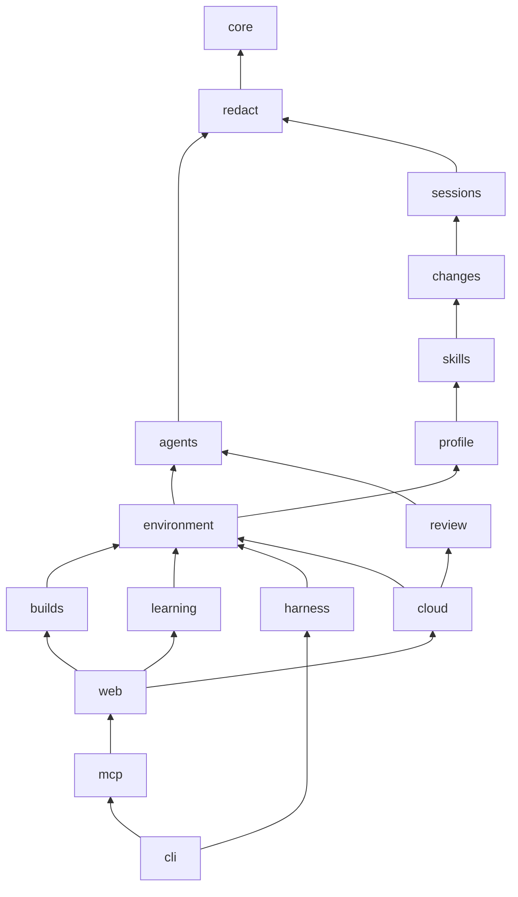
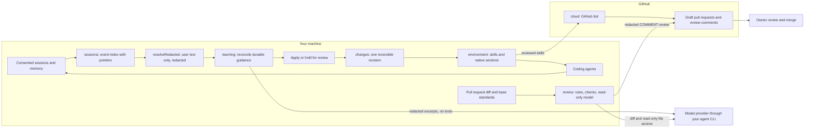

# Architecture

Shadowclone turns durable guidance from consented sessions into skills that existing coding agents use. Local records keep evidence, scope, publication decisions, and revisions. Native instructions route tasks to the right skills.

## Packages

The repository is a Bun workspace. Each package is `@shadowclone/<name>` and has an `AGENTS.md` with its rules.

| Package                                               | Purpose                                                                                   |
| ----------------------------------------------------- | ----------------------------------------------------------------------------------------- |
| [`core`](../../packages/core/AGENTS.md)               | Files, processes, ownership, configuration, and product identity                          |
| [`redact`](../../packages/redact/AGENTS.md)           | Secret scrubbing                                                                          |
| [`agents`](../../packages/agents/AGENTS.md)           | Run `claude`, `codex`, `cursor-agent`, and `pi` without a terminal                        |
| [`sessions`](../../packages/sessions/AGENTS.md)       | Read transcripts, index events, derive signals, and resolve redacted text                 |
| [`review`](../../packages/review/AGENTS.md)           | Pull request review engine                                                                |
| [`changes`](../../packages/changes/AGENTS.md)         | Reversible local writes, stored as revisions                                              |
| [`skills`](../../packages/skills/AGENTS.md)           | Skill files without model calls: library, quality rules, discovery, and proposals         |
| [`profile`](../../packages/profile/AGENTS.md)         | Learned rule model, legacy profile, references, and Claude memory migration               |
| [`environment`](../../packages/environment/AGENTS.md) | What agents receive: environment records, publication, native sections, install, and undo |
| [`builds`](../../packages/builds/AGENTS.md)           | Agent builds: catalog, plan, apply, sync, and retire                                      |
| [`learning`](../../packages/learning/AGENTS.md)       | Evidence to guidance: distillation, reconciliation, workers, probes, and `remember`       |
| [`harness`](../../packages/harness/AGENTS.md)         | Repository harness for `init --repo` and `check`                                          |
| [`cloud`](../../packages/cloud/AGENTS.md)             | GitHub bot setup, workflows, export, and status                                           |
| [`web`](../../packages/web/AGENTS.md)                 | Wizard server and client, voice capture, and browser setup for the cloud bot              |
| [`mcp`](../../packages/mcp/AGENTS.md)                 | MCP server                                                                                |
| [`cli`](../../packages/cli/AGENTS.md)                 | Commands, the `bin` entry, build, stage, and publish                                      |
| [`evals`](../../evals/AGENTS.md)                      | Private evaluation suites                                                                 |
| [`tooling`](../../tooling/AGENTS.md)                  | Repository checks that `bun run lint` runs                                                |

`skills/`, `preferences/`, and `plugins/` stay at the repository root, because people and skill installers look for them there. Only `@shadowclone/cli` goes to npm. Its build bundles the other packages.

## Dependencies

An arrow points from a package to a package that it imports. The graph omits an arrow when another path already implies it. For example, `cli` also declares `review`, but `mcp`, `web`, and `cloud` already lead to it.

```mermaid
graph BT
  redact --> core
  agents --> redact
  sessions --> redact
  changes --> sessions
  skills --> changes
  profile --> skills
  environment --> profile
  environment --> agents
  builds --> environment
  learning --> environment
  harness --> environment
  review --> agents
  cloud --> environment
  cloud --> review
  web --> builds
  web --> cloud
  web --> learning
  mcp --> web
  cli --> mcp
  cli --> harness
```

The full list of allowed imports for each package is in `tooling/src/boundaries/packages.ts`. `bun run lint` checks every import against it and fails on a cycle. A package exposes `.` and, where needed, `./testing` for fixtures and `./browser` for modules that the web client loads. See [design record 038](../design/038-packages-and-plain-english.md) for the reasons.

## Data flow

Data stays on your machine except for the model requests and GitHub actions that you authorize.

```mermaid
flowchart LR
  subgraph Machine["Your machine"]
    Sources["Consented sessions and memory"] --> Index["sessions: event index with pointers"]
    Index --> Redaction["resolveRedacted: user text only, redacted"]
    Redaction --> Learning["learning: reconcile durable guidance"]
    Learning --> Review["Apply or hold for review"]
    Review --> Revision["changes: one reversible revision"]
    Revision --> Delivery["environment: skills and native sections"]
    Delivery --> Agents["Coding agents"]
    Agents --> Sources
    Diff["Pull request diff and base standards"] --> Judge["review: rules, checks, read-only model"]
  end
  Learning -- "redacted excerpts, no tools" --> Provider["Model provider through your agent CLI"]
  Judge -- "diff and read-only file access" --> Provider
  Delivery -- "reviewed skills" --> Bot["cloud: GitHub bot"]
  subgraph GitHub["GitHub"]
    Bot --> Pulls["Draft pull requests and review comments"]
  end
  Judge -- "redacted COMMENT review" --> Pulls
  Pulls --> Owner["Owner review and merge"]
```

## Trust boundaries

| Boundary                | What crosses it                                    | Control                                                                         |
| ----------------------- | -------------------------------------------------- | ------------------------------------------------------------------------------- |
| Source files to index   | Pointers and event metadata, never transcript text | One default-off consent flag for each source. Managed policy can only narrow it |
| Index to model          | Redacted user text, with labeled agent context     | `resolveRedacted`, then a learning run with no tools and fixed limits           |
| Model output to files   | Proposed edits to skills and native sections       | Reversible revisions, ownership fingerprints, and kept manual edits             |
| Browser to local server | Wizard actions                                     | Loopback address, ephemeral token, and origin check                             |
| Machine to GitHub       | Reviewed skills, secrets, and review text          | Owner approval of an exact preview. Secrets go through standard input           |
| Evaluation              | Synthetic tasks, receipts, and held-out cases      | Private storage outside every checkout, and an approved scope for each paid run |

[Data handling](../data-handling.md) lists every source, local file, and model request.

## How the packages work together

`sessions` indexes events and gives `learning` only the text that the current consent allows. `learning` reconciles that text with the existing guidance and calls the model through `agents`. It holds a proposal for review when the evidence is weak, in conflict, or out of scope.

`environment` publishes accepted guidance as skills and short native sections. It writes through `changes`, so each publication is one revision that `undo` can reverse. `builds` and `harness` use the same publication path for terminal and browser choices and for repository setup. The CLI owns prompts and output.

The code checks source authorization when it selects an event and again when it resolves the reference of the event. Automatic skill writes need a separate authorization. A later correction creates a review signal. An authorized probe sends redacted guidance to an isolated native session. Its exact-response check does not prove hook delivery or future compliance.

## Delegated work

Outside the cloud bot, Shadowclone does not commit, push, or act on GitHub itself. Delegated work is the `shadowclone-work` skill. It runs in your agent session and acts through the tools and permissions of that session. See [delegated work](../guides/delegated-work.md). The optional Claude subagent runs in the same way.

The cloud bot is a separate contract. The owner reviews a frozen skills bundle and chooses the repositories. GitHub Actions run the same skill, and the owner merges. See [cloud bot](../guides/cloud-bot.md) and [data handling](../data-handling.md#personal-github-clones).

Earlier versions had a task harness and a headless `run` command. [Design record 029](../design/029-narrow-the-surface.md) explains the `run` removal. [Design record 030](../design/030-shadowclone-work-eval.md) explains the harness removal.

Provider transcripts stay where the provider keeps them. Later learning still needs source consent and durable user guidance. A review comment, a merge, a deletion, or a successful agent result does not establish a preference.

## Read by topic

- [Capture](01-capture.md): source adapters, eligible content, and incremental indexing.
- [Learning and skill delivery](02-profile.md): evidence, publication, scope, and migration.
- [Engine](03-engine.md): provider capabilities and execution limits.
- [Evaluations](../../evals/README.md): the suites, what they measure, and how to authorize paid runs.
- [Data handling](../data-handling.md): sources, storage, model requests, removal, and the rules that a change must keep.
- [Enterprise controls](../guides/enterprise.md): scope and managed policy.
- [Design records](../design/README.md): historical decisions. Later records can replace earlier designs.
