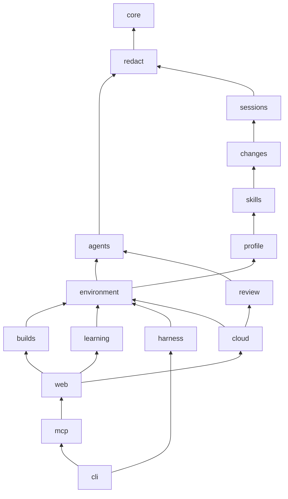

# Workspace packages and plain English by default

## Problem

All code was in one `src/` folder of about 59,000 lines. Its 30 modules formed one import cycle of 20 modules. No module had a clear boundary, and no part could ship as its own package. Tests were about 34,000 lines in 365 files, and some of them repeated other tests.

The documentation was long, and parts of it were out of date. Agent lists left out Pi, cloud bot pages described only Claude, and no page described the MCP tools. A visitor did not see what Shadowclone does. Agents wrote prose in their own style, because the plain English skill loaded only when a user selected it.

## Decision

**Bun workspaces and Turborepo.** The repository is a Bun workspace with the isolated linker, so a package can import only the dependencies that it declares. Turborepo runs typecheck, lint, test, and build for each package and caches the results. Bun alone runs scripts in dependency order, but it has no task cache.

**Packages.** Code moves to `packages/<name>`. Each package is `@shadowclone/<name>`, is private, and exports its public surface from `src/index.ts`. Packages import each other only by name, plus a `/testing` subpath for fixtures and a `/browser` subpath for modules that the web client can load. The packages with a `/browser` subpath are `builds`, `cloud`, `environment`, and `learning`.

| Package       | Purpose                                                                                     |
| ------------- | ------------------------------------------------------------------------------------------- |
| `core`        | Files, processes, ownership, config, and product identity                                   |
| `redact`      | Secret scrubbing                                                                            |
| `agents`      | Run `claude`, `codex`, `cursor-agent`, and `pi` without a terminal                          |
| `sessions`    | Read transcripts, index events, derive signals, and resolve redacted text                   |
| `review`      | Pull request review engine                                                                  |
| `changes`     | Reversible local writes, stored as revisions                                                |
| `skills`      | Skill files without model calls: library, quality rules, parsing, discovery, and proposals  |
| `profile`     | Learned rule model, legacy profile, references, and Claude memory migration                 |
| `environment` | What agents receive: environment records, publication, native integrations, install, undo   |
| `builds`      | Agent builds: catalog, plan, apply, sync, and retire                                        |
| `learning`    | Evidence to guidance: distillation, reconciliation, skill assessment, workers, and remember |
| `harness`     | Repository harness (`init --repo` and `check`)                                              |
| `cloud`       | GitHub bot setup, workflows, export, and status                                             |
| `web`         | Wizard server and client, voice, and browser setup for the cloud bot                        |
| `mcp`         | MCP server                                                                                  |
| `cli`         | Commands, the `bin` entry, build, stage, and publish                                        |

`skills/` and `plugins/` stay at the repository root, because people and skill installers look for them there. `evals/` and `tooling/` are private workspaces.

**Cycle fixes are moves.** A script checked every value and type import against the graph. These moves remove every production violation, and none of them changes behavior:

- `EngineId` moves to `core`. The seed library lookup moves to `core/distribution.ts`. The product name and version move to `core/product.json`.
- `resolveRedacted` and `captureRoots` move to `sessions`, because they read session records.
- `src/index/` becomes `eventIndex/`, so that a module barrel does not collide with a package entry.
- The cloud browser setup files move to `web`. The CLI install files move to `environment`.
- `undoRevision`, `writeProfile`, `readProfileSnapshot`, and the seed guidance writer move to `environment`.
- Build schemas, build directories, build integrations, and build routing move to `environment/builds/`. The harness manifest and recipes move to `environment/harness/`.
- The skill maintenance files that call a model, and the 11 learning files in `environment`, move to `learning`.
- About 30 tests move to the package that has what they import. The test count stays the same.

**One published package.** Only `@shadowclone/cli` goes to npm. Its build bundles the workspace packages, and a stage step writes the published manifest from an allowlist. The tarball keeps the same files, `bin`, and dependencies. Release Please keeps the root component, and it bumps the version in `core/product.json`. Workspace manifests have no version, so a release PR does not change `bun.lock`.

**Package guides.** Every workspace has an `AGENTS.md` and a `CLAUDE.md`. This covers the 16 packages, `evals`, and `tooling`. `CLAUDE.md` holds only `@AGENTS.md`, because Codex reads `AGENTS.md` files and Claude Code loads a nested `CLAUDE.md` when it reads a file in that folder. A guide states the purpose of the package and the modules that it owns. It also lists the rules that a change must keep and how to run the tests.

A generated facts block in each guide lists the package name, the dependencies, and the export subpaths. `bun run guides` writes the block from `package.json`. Lint fails when a guide is missing, when `CLAUDE.md` differs, or when the block is out of date. An agent that changes the purpose, the public exports, the dependencies, or a rule updates the guide in the same commit. The root `AGENTS.md` states this rule.

**Plain English is always on.** The bundled skill `write-plain-english` gets the metadata `shadowclone-always-on: "true"`. Selection and routing include it whatever the build choices are, and both wizards show it as locked on. `shadowclone sync` adds it to existing builds. Its routing line is "before you write any text that a person reads".

**Documentation.** Every Markdown file except `CHANGELOG.md` uses ASD-STE100 Simplified Technical English at about 80% strictness. The lint step runs `check-ste` and a relative link check on all Markdown (`tooling/src/prose.ts`). The bundled skills, the preferences, and test fixtures have their own checks. The README leads with what Shadowclone does, then a quick start, the bundled skills, results, privacy, and links to guides.

**Tests stay only when they add value.** The cleanup removes a test that repeats another test or checks only a constant, a copied string, or mock calls. It also removes a test of an inner step that a higher test covers. Tests on privacy, consent, redaction, file ownership, migration, cloud secrets, and CLI output stay. The line coverage of each source file must not drop without a stated reason.

## Consequences

The `environment` and `learning` packages are still the largest, because the product core shares one store. Each package can become public later. To publish one, remove `private`, add a version, and add it to Release Please.

The source checkout locates `skills/` and `preferences/` from the workspace root, and the installed CLI locates them next to `dist/`. Both lookups live in `core/distribution.ts`.

## Verification

- `bun install --frozen-lockfile` and `bun run check` pass.
- The set of test names is the same before and after the moves.
- The staged tarball has the same file list as before, except the bundled HTML path.
- The installed tarball runs `--help`, `--version`, `skills`, `init --status --json`, MCP `tools/list`, and the wizard on a synthetic home folder with the same output as before.
- `tooling/src/boundaries.ts` reports no import that leaves its package or breaks the graph.
- `bun run guides` makes no change, and `bun run lint` reports no prose error, no broken link, and no stale guide.
