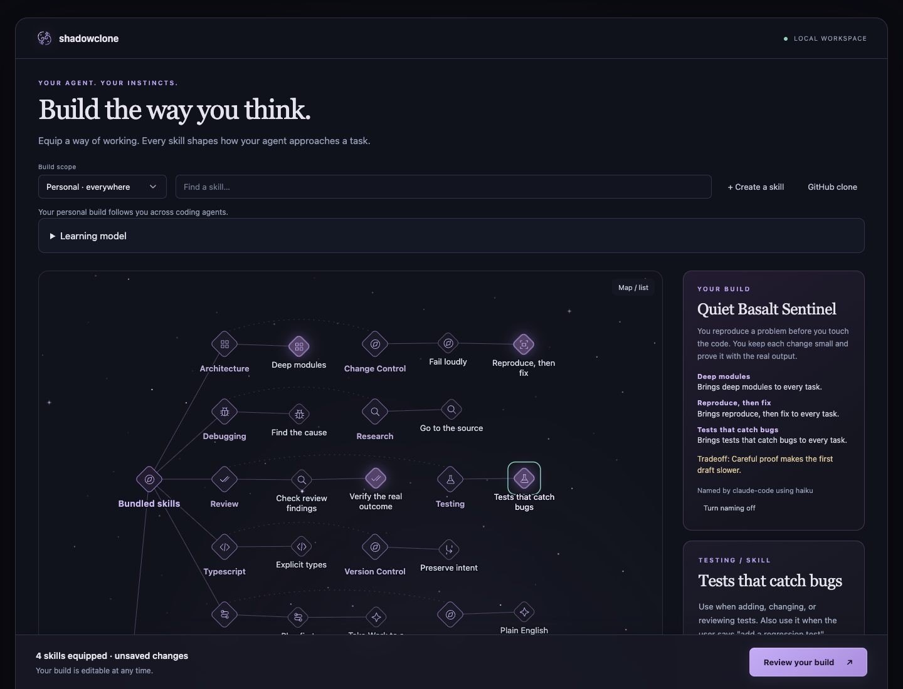
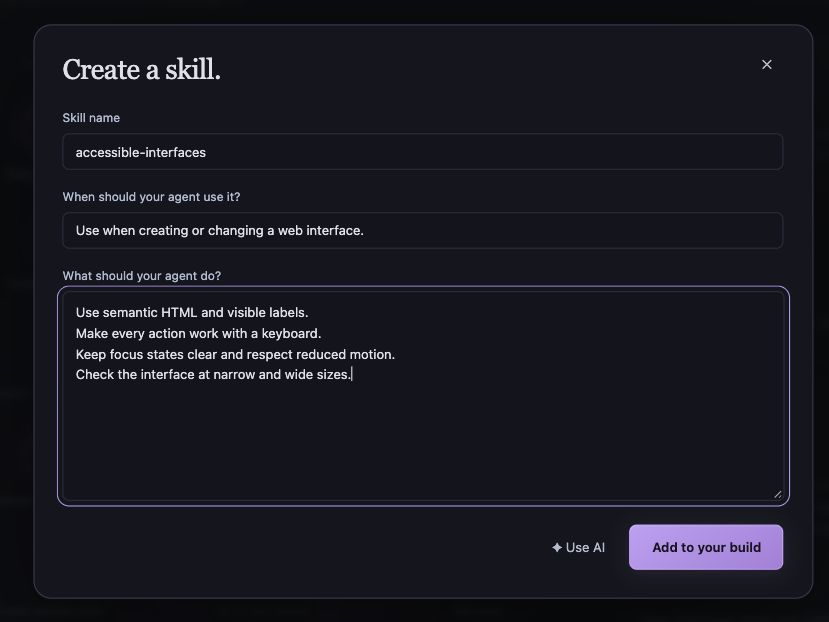

# Agent builds

Choose and equip skills from a star map grouped by source and category:

```bash
shadowclone wizard
```



Select a skill to read its instructions and decide whether to equip it. Keep a personal build across agents, tailor a private build to a repository, or choose shared repository standards. **Review your build** shows the files that will change before you apply it. You can return and adjust your build at any time.

If you share files between agents with links, the wizard follows your layout. When `~/.claude/skills/<name>` links to the skill's own folder, for example `~/.agents/skills/<name>`, that agent already reads the skill, so the wizard writes nothing there. When an agent's instruction file links to a file in your home folder, the review shows that real file as the one that changes. A link to anywhere else is skipped and named in the review.

A bundled skill can include supporting files, such as a checker script or a page template. Applying the build copies them next to each installed `SKILL.md`. A later version replaces copies you have not edited. If you edited a copy, applying stops and names the conflict. Unequipping a skill removes its unedited files and keeps edited ones, with a warning.

The map shows every local skill at once. Skills group by source first: bundled skills, working preferences, your custom skills, your skills, and one group for each plugin. Inside a source, skills group by category. The map reads left to right, and a large group wraps onto more lines, so the page scrolls down with no zoom. One click on a skill equips or unequips it and shows its details. One click on a category equips every skill in it. If they are all equipped, the click unequips them. The chevron next to a category or source collapses that group and shows how many skills it hides. Groups start expanded, and the wizard remembers collapsed groups in this browser. A skill that a plugin manages cannot be equipped, but its details offer a local companion. Search highlights the matching skills. **Map / list** shows every skill in a compact list, which is the default on narrow screens.

## Your build name

The character sheet names your build, with a short profile, three abilities tied to your equipped skills, and one tradeoff. Five seconds after your last equip change, the wizard asks your fast model for a new name. On Claude Code that is the `haiku` alias at high effort. The alias means Haiku 5.5 on the Anthropic API, and Haiku 4.5 on Amazon Bedrock, Google Cloud, Microsoft Foundry, and Claude Platform on AWS. On Codex it is `gpt-6-luna` at high effort. The sheet says which engine and model wrote the name. A saved build that you open without a change shows **Name my build** instead, so opening the wizard makes no model request. If naming fails, the sheet shows the error and a **Retry** button. **Turn naming off** stops all naming requests in this browser.

## Your writing voice

Skills that write for you, such as pull request and review skills, read `~/.agents/voice.md`. **My voice** can draft that file from your own GitHub writing:

1. Choose **My voice** and allow Shadowclone to read your GitHub writing. It reads through your `gh` login.
2. Choose **Read my writing and describe my voice**. Your learning model describes how you write and writes 3 invented examples.
3. Edit any line of the description. Choose **Rewrite the samples** to see the examples follow your edits.
4. Choose **Save my voice** to write `~/.agents/voice.md`, or **Discard**.

The dialog never shows your writing itself. Shadowclone skips text that an agent wrote, and it discards a result that copies 8 or more of your words in a row. If `~/.agents/voice.md` already exists or is a link, Shadowclone does not change it. [Data handling](../data-handling.md) lists what is read and sent.

## Create a skill

Choose **Create a skill**, give it a name, explain when it applies, and write what the agent should do.

**Use AI** can help draft the instructions. Review the text, provider, and limits before sending, then edit the result before adding it to your build. Applying the build is a separate step.

<p align="center"></p>

## Other ways to open the wizard

| Command | Use it to |
| --- | --- |
| `shadowclone wizard --repo` | Open a private build for the current repository |
| `shadowclone wizard --no-open` | Print the local URL instead of opening a browser |
| `shadowclone wizard --cli` | Configure a build in the terminal |

Keep the command running while using the browser editor. Ctrl+C stops it. Opening the editor makes no model request.

After applying a build, open a new coding-agent session to load the installed guidance.
